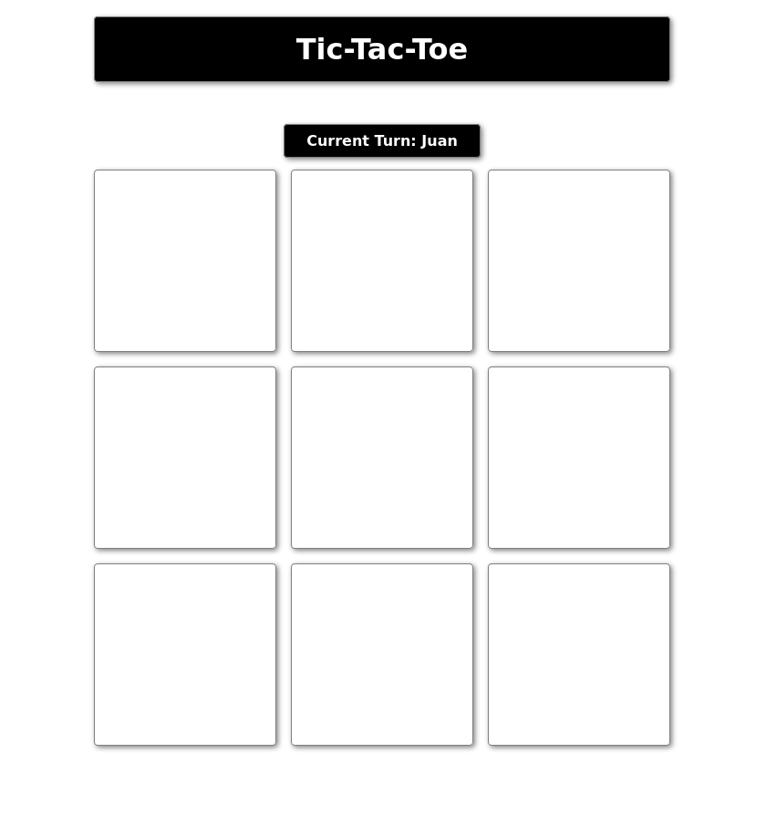

# tic-tac-toe
A tic-tac-toe game made following The Odin Project
Live demo [_here_](https://santyru-c.github.io/tic-tac-toe/).

## General Information
This project was made with the intention of practicing JS Factory Functions and the Module Pattern. 
Most of the concepts applied are related with those learnt from [this lesson](https://www.theodinproject.com/lessons/node-path-javascript-factory-functions-and-the-module-pattern) from TOP:

- Factory functions
- Closure and factory methods
- Module Pattern
- IIFE

But, the most important concept that I learnt from this lesson was:

- Do NOT skip planning time for your code.

## Comments About The Project
In this particular case, the time spent on the project was awfully long. Although the necessary logic to make a console tic-tac-toe game is fairly simple, I went straight to writing the code without any planning. 
Ignoring that important step costed me many hours of refactoring objects and methods until I took the decision to start from scratch with proper planning. It was no surprise that the second iteration of the project tackled the objectives of the lesson in less time and with fewer setbacks.

## Technologies Used
- 
- 
- 

## Screenshots

## Usage
Just load the page and type down the player's names (optional) and click on the play button to start the game.

## Project Status
Project is: _complete_

## Room for Improvement
To do:
- Although the main objectives of the project were achieved. I would start working on the remaining optional objective of coding an AI using the minimax algorithm.

## Contact
Created by [Santyru-C](https://github.com/Santyru-C) - feel free to contact me!